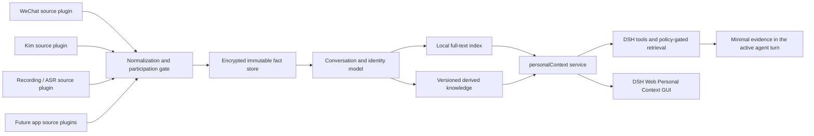

# DSH Personal Context Hub Design

**Date:** 2026-08-17  
**Status:** Approved  
**Scope:** Replace keyboard/OCR-based chat capture with passive, source-specific
history synchronization and expose the resulting personal context through
DeepSeek Harness (DSH).

## 1. Decision

Build a DSH-native `personal-context` plugin bundle with an independent local
data core.

DSH is the always-on runtime, plugin host, job scheduler, retrieval surface, and
GUI host. Long-term personal data is not stored in DSH's session event log. It
is stored in an encrypted, schema-versioned local database owned by the
Personal Context service. The DSH session log records only references to the
evidence used in an agent turn.

This is the selected “B+” architecture:

- native DSH plugins and configuration;
- source-neutral, exportable local data model;
- no dependency on DSH session internals for durable personal memory;
- no OCR, event interception, synthetic input, focus changes, or clipboard
  modification.

DSH is currently a developer preview and explicitly permits breaking changes.
The integration therefore pins a tested DSH version and places all DSH-specific
APIs behind a small compatibility adapter.

References:

- <https://github.com/deepseek-ai/deepseek-harness>
- <https://github.com/deepseek-ai/deepseek-harness/blob/master/docs/architecture.md>

## 2. Goals

1. Periodically synchronize Kim and WeChat conversations in which the user has
   spoken.
2. Preserve the complete context of every qualifying conversation, including
   messages from other participants after the conversation qualifies.
3. Reliably distinguish the user's messages, other participants' messages, and
   system events from source-owned identity and direction fields.
4. Normalize chat, recording ASR, and future app sources into one provenance-rich
   local context model.
5. Derive traceable knowledge such as decisions, commitments, tasks, people,
   preferences, topics, and summaries without replacing raw facts.
6. Let DSH retrieve the smallest relevant local evidence set for an active user
   request.
7. Provide a DSH Web GUI for health, conversations, ASR, search, knowledge,
   identity correction, and privacy controls.
8. Keep message sending and normal application use completely unaffected.

## 3. Non-goals

- Capturing every physical keystroke.
- Reading a composer before send.
- Using screenshots or OCR as a fallback.
- Selecting or copying application text.
- Injecting into Kim or WeChat processes.
- Intercepting application network traffic.
- Copying or OCR-processing chat attachments in the first release.
- Persisting conversations in which the user never participated.
- Sending the entire knowledge base or raw history to a remote model.
- Treating model-inferred identities or reply relationships as source facts.

## 4. System architecture



### 4.1 DSH bundle

The `personal-context` bundle mounts:

- a `ctx.personalContext` capability definition;
- an encrypted local store provider;
- Kim, WeChat, ASR, and future source connector providers;
- background synchronization and reconciliation jobs;
- normalization, identity, indexing, and knowledge services;
- model-facing retrieval tools;
- DSH Web routes and UI nodes;
- a privacy policy provider;
- health and diagnostics providers.

The bundle is installed beside DSH's normal plugins. It does not patch the
agent loop or modify DSH upstream code.

### 4.2 Runtime profile

A local headless DSH profile runs continuously and performs synchronization
without requiring the Web UI to be open. The Web profile exposes the same
Personal Context service and GUI when the user opens DSH Web.

## 5. Source connector contract

Every source plugin implements a versioned contract equivalent to:

```text
discoverAccounts()                 -> SourceAccount[]
discoverConversations(cursor?)     -> ConversationPage
syncMessages(conversation, cursor) -> MessageChangePage
backfill(conversation, boundary?)  -> MessagePage
health()                           -> SourceHealth
```

Connector results contain source-native identifiers and evidence. The
normalization layer, not the connector, owns cross-source identity and knowledge
logic.

Required connector properties:

- read-only access to the source;
- stable account, conversation, participant, and message identifiers;
- an authoritative outbound/inbound or sender identity field;
- source timestamps and change types;
- a durable incremental cursor or a deterministic high-water mark;
- explicit capability flags for edits, retractions, reply links, and deletes;
- bounded reads that do not lock or mutate the active app database;
- no message bodies in logs or health payloads.

### 5.1 Feasibility gate

Kim and WeChat each require a read-only feasibility spike before production
implementation. The spike must prove that the local source can provide:

- the active user's source account identity;
- conversation and participant identity;
- stable message identity;
- final message text;
- authoritative sender/direction;
- a usable timestamp or ordering key;
- incremental change detection.

If a source cannot satisfy these requirements safely, its connector remains
disabled. The system does not fall back to OCR, UI automation, network capture,
or guessed text.

## 6. Synchronization semantics

### 6.1 Participation gate

Initial discovery reads only the minimum conversation index needed to determine
whether the user has sent at least one message. Once a conversation qualifies,
the connector backfills its complete accessible history and follows all future
changes from every participant.

Conversations in which the user never speaks are not persisted. Temporary
records used during discovery are discarded at the end of the transaction.

### 6.2 Scheduling

- Source changes may trigger a prompt incremental job when a safe file-change
  signal is available.
- Every enabled connector polls once per minute by default.
- A low-priority reconciliation runs every six hours to repair missed changes.
- Full backfill and index rebuild jobs are pausable and rate-limited.
- Jobs never block an agent turn or an application send action.

### 6.3 Idempotency and ordering

Normalized message uniqueness is based on:

```text
source_type + source_account_id + source_message_id
```

Each connector commits its cursor only after the corresponding normalized
transaction commits. Duplicate pages are harmless. Out-of-order changes are
stored and projected deterministically by source order and source timestamp.

Edits, retractions, and deletions are append-only change events. They update the
current projection without destroying the prior evidence version.

## 7. Identity and conversation model

The source account mapping defines which source identities belong to the user.
Normalized message direction is one of:

- `self` — authoritatively sent by a configured user identity;
- `other` — sent by another participant;
- `system` — source-owned system event;
- `unknown` — insufficient source evidence.

Models cannot promote `unknown` to `self` or `other` as a fact.

A cross-source person may own multiple source identities. The GUI supports
manual merge and split operations. These operations are versioned and
reversible.

Reply relationships are authoritative only when the source provides an
original reply/reference identifier. Derived conversational associations are
stored separately with a confidence and derivation method.

## 8. Data layers

### 8.1 Immutable fact layer

The fact layer stores:

- source accounts and identities;
- conversations and participants;
- message change events and current projections;
- recording references and ASR segments;
- source timestamps, ingestion timestamps, and cursors;
- source and adapter versions;
- provenance and integrity metadata.

Raw facts are never overwritten by summaries.

### 8.2 Unified context layer

Every normalized event answers:

```text
who + did/said what + when + in which source/conversation + with what evidence
```

Chat conversations and recordings remain separate unless an explicit source
relationship exists. A possible cross-source association may be generated only
when multiple signals agree and remains low-confidence until the user confirms
it.

### 8.3 Derived knowledge layer

Derived knowledge may include:

- people and relationships;
- projects and topics;
- decisions and conclusions;
- commitments, tasks, and deadlines;
- preferences and longer-lived facts;
- conversation and time-window summaries.

Every knowledge record stores evidence references, derivation method, model or
rule version, confidence, validity state, and supersession links. A source edit,
retraction, deletion, identity correction, or conversation exclusion invalidates
affected knowledge and queues local recomputation.

Deterministic fields are extracted with rules. Automatic semantic extraction
uses a local model. If no local model is available, ingestion and retrieval
continue while semantic derivation remains pending.

## 9. ASR integration

Recording sources create recording facts and timestamped transcript segments.
Audio is referenced in place rather than duplicated by default.

A segment is labeled as the user only when supported by an explicit channel,
confirmed voice identity, or manual correction. Otherwise its speaker remains
`unknown`.

The GUI supports:

- assigning and correcting speakers;
- mapping a confirmed speaker to a cross-source person;
- reviewing candidate links between recordings and chats;
- accepting or rejecting derived links;
- invalidating knowledge affected by a correction.

Timestamp proximity alone is never sufficient to merge a recording with a chat
conversation.

## 10. Search and DSH retrieval

The first release uses SQLite full-text search inside the encrypted store.
Local vector retrieval is a later optional provider and does not require a data
model change.

The DSH bundle exposes tools equivalent to:

```text
personal_context.search
personal_context.get_conversation
personal_context.get_timeline
personal_context.get_person
personal_context.get_evidence
personal_context.correct_identity
```

Tool results contain concise excerpts and opaque evidence identifiers. The
agent requests full evidence only when needed.

Remote-data policy is local-first:

1. Raw chat and ASR remain local at rest.
2. Local search and privacy filtering run before model-visible output.
3. Only an active user request may cause matched excerpts to enter a remote
   model request.
4. Excluded or restricted items are removed before tool output or context
   injection.
5. The DSH session log records evidence identifiers used by the turn, not a
   duplicate of the whole conversation.
6. Automatic background knowledge extraction uses only a local model.

The default interaction is tool-first. Optional automatic retrieval may be
enabled later as a policy-gated plugin, but it must follow the same minimum
evidence and privacy rules.

## 11. DSH Web GUI

DSH Web gains a top-level **Personal Context** area with five views.

### 11.1 Overview

- per-source status and compatibility;
- last successful synchronization and current lag;
- record counts, queued jobs, index health, and storage use;
- connector-specific errors without message text;
- clear separation between DSH health and connector health.

### 11.2 Conversations

- filters for app, account, person, group, direction, and time;
- a timeline that distinguishes self, other, and system events;
- source evidence, replies, edits, and retractions;
- conversation exclusion controls.

### 11.3 Search and knowledge

- cross-source full-text search;
- views for decisions, tasks, people, facts, preferences, and summaries;
- evidence drill-down;
- controls to reject incorrect knowledge and correct labels.

### 11.4 ASR

- recordings and transcript segments;
- speaker correction and identity mapping;
- candidate chat/recording relationships with explicit confirmation.

### 11.5 Sources and privacy

- enable, pause, synchronize now, backfill, and rebuild index;
- account identity and schedule configuration;
- app, account, conversation, and person exclusion policies;
- sensitivity classification and remote-use policy;
- separate deletion for derived knowledge and raw local facts;
- open-format export.

Destructive raw-data actions require explicit confirmation. Deleting local
facts never deletes data from Kim, WeChat, or the original recording source.

## 12. Security and privacy

- All services and GUI routes listen only on the loopback interface by default.
- The personal database is encrypted at rest; its key is held in macOS Keychain.
- Database files, exports, and runtime state use owner-only permissions.
- Connector access is read-only.
- Message bodies never enter ordinary logs, metrics, health endpoints, or DSH
  session diagnostics.
- Privacy exclusions apply before indexing, derivation, tool output, and model
  injection.
- Export and deletion operations are auditable locally.
- Attachments are represented by metadata and references only in the first
  release; no screenshot or image OCR path exists.

## 13. Failure handling

- Connectors have isolated queues, cursors, retries, and circuit breakers.
- Retry uses bounded exponential backoff and jitter.
- Repeated failures pause only the affected connector and surface a GUI alert.
- A source mutation during a read invalidates that read; no partial message is
  committed.
- Malformed records enter a quarantine containing identifiers and error codes,
  not unredacted content in logs.
- Schema migrations are transactional and retain a recoverable pre-migration
  backup.
- DSH upgrades require compatibility and connector contract tests before the
  pinned version changes.
- A connector format mismatch is explicit and never silently downgraded to an
  unsafe capture method.

## 14. Migration from OmniMe

1. Run Kim and WeChat feasibility spikes without production writes.
2. Create the DSH bundle, encrypted data core, connector contract, background
   jobs, and GUI shell.
3. Run new connectors in shadow mode. Data is visible in the GUI but unavailable
   to agent retrieval until live acceptance tests pass.
4. Enable local retrieval and minimum-evidence DSH tools.
5. Disable OmniMe keyboard/OCR chat capture. Normal app input is no longer part
   of the chat ingestion architecture.
6. Preserve the existing OmniMe database unchanged. Import only trustworthy
   historical records as `legacy_ominime`; unverified content does not enter
   the derived knowledge layer.
7. Retire the standalone `127.0.0.1:8001` dashboard after DSH Web reaches feature
   parity, while retaining a read-only export path during transition.
8. Add ASR and later app connectors only after Kim and WeChat are stable.

## 15. Verification gates

### 15.1 Connector contract tests

- account and self-identity discovery;
- qualifying versus non-qualifying conversation discovery;
- final message content and direction;
- pagination, cursor resume, duplicate pages, and out-of-order changes;
- reply, edit, retraction, and deletion capability behavior;
- version incompatibility and safe disablement.

### 15.2 Data and privacy tests

- idempotent normalization;
- append-only revision history and deterministic current projection;
- participation filtering;
- reversible person merge and split;
- knowledge invalidation from source or identity changes;
- exclusion before indexing, derivation, retrieval, and remote-visible output;
- encrypted store and owner-only file permissions;
- absence of message bodies from logs and health APIs.

### 15.3 Runtime tests

- pause, crash, restart, stale cursor, locked source, and malformed source data;
- connector circuit breaking without DSH or cross-connector failure;
- bounded CPU and I/O during idle polling, backfill, and reconciliation;
- DSH version compatibility and Web plugin loading;
- transactional migration and rollback.

### 15.4 Live acceptance tests

For both Kim and WeChat, use a dedicated real conversation to verify:

- a user message and another participant's reply;
- a reply/reference message;
- an edit and a retraction where supported;
- correct self/other attribution and stable identities;
- eventual synchronization without any visible app interaction;
- no OCR, keyboard interception, focus change, clipboard change, or send delay.

ASR acceptance covers unknown speakers, manual correction, identity mapping, and
rejection of an incorrect chat association.

## 16. Success criteria

- Chat application behavior is unchanged and no send path depends on OmniMe.
- Kim and WeChat synchronize complete qualifying conversations with authoritative
  self/other attribution.
- Synchronization is eventually consistent, idempotent, observable, and
  recoverable.
- Every derived knowledge item is traceable to local evidence.
- Raw personal data remains local by default.
- A remote model sees only policy-approved, minimum necessary excerpts during an
  active user request.
- DSH Web is the single operational GUI for personal context.
- The legacy OmniMe database remains intact through migration.

## 17. Known risks

- Kim or WeChat may encrypt or change local storage in a way that prevents a
  safe structured connector. This is a feasibility gate, not a reason to revive
  OCR or UI automation.
- DSH developer-preview APIs may break. Version pinning, a compatibility adapter,
  and contract tests limit the blast radius.
- Full-history backfill may be expensive. Participation-first discovery,
  pagination, rate limits, and pausable jobs bound the impact.
- Incorrect cross-source identity merges can contaminate knowledge. Manual,
  reversible merges and evidence-preserving derivation are required.
- Local semantic extraction may lag if a local model is unavailable. Raw
  ingestion and full-text retrieval must remain functional without it.

