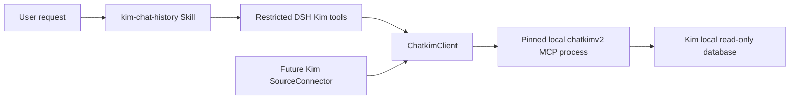

# Kim Chat Skill Design

**Date:** 2026-08-18

**Status:** Approved

**Scope:** Add an on-demand, read-only Kim chat Skill to the OmniMe DSH bundle by
calling a separately installed and locally verified `chatkimv2` reader. This
design does not enable background synchronization, knowledge persistence,
WeChat ingestion, or legacy-capture cutover.

## 1. Decision

The user authorizes an audited local-database adapter for Kim. This supersedes
the earlier Kim investigation constraint that admitted only a vendor-owned API,
but it does not weaken the remaining read-only, privacy, evidence, or G2
requirements.

Keep `chatkimv2` outside the OmniMe process and place one narrow DSH adapter in
front of it. Register a runtime Skill that teaches the agent when and how to use
four restricted DSH tools. The Skill never invokes a shell or the reader
directly.

The first release is on-demand only. It proves that OmniMe can safely query Kim
without OCR or UI interaction. The existing `SourceConnector` remains disabled
until the separate incremental-sync gate passes.

## 2. Architecture



The bundle owns the child-process lifecycle. `ChatkimClient` starts the reader
with an absolute executable path, no shell, a minimal environment, and MCP over
stdio. Tool arguments therefore do not appear in the process list. Cancellation,
timeout, malformed output, output overflow, or process failure terminates the
child and returns a fixed plugin-owned error.

## 3. Runtime configuration and provenance

The adapter is disabled unless both values are configured locally:

- `OMINIME_CHATKIM_BIN`: absolute path to a regular, non-symlink executable;
- `OMINIME_CHATKIM_SHA256`: exact lowercase SHA-256 of that executable.

The adapter rejects a missing path, relative path, symlink, non-regular file,
group/world-writable file, hash mismatch, unsupported reader response, or
unexpected schema. It does not commit an internal repository URL, source
checkout path, device identifier, account identifier, or derived database key.

The child receives only the minimum host environment required for local Kim
discovery. The adapter never forwards `CHATKIM_KEY`,
`CHATKIM_PLATFORM_UUID`, dynamic-loader variables, proxy variables, or arbitrary
parent environment entries.

## 4. Restricted tool surface

The DSH Host plugin registers:

- `kim_chat_status`: sanitized availability, connection, read-only, and schema
  status;
- `kim_chat_conversations`: bounded recent conversation discovery;
- `kim_chat_messages`: bounded message query by conversation and time range;
- `kim_chat_context`: bounded context around one message.

The tools reject unknown properties and apply their own limits before calling
the reader. They do not expose account discovery paths, database diagnostics,
schema inspection, arbitrary reader operations, raw metadata, attachment files,
arbitrary SQL, reader stderr, or environment configuration.

The adapter validates every returned envelope and projects only approved fields.
For messages, it obtains the current user identifier from the same reader and
sets direction deterministically:

```text
sender_id == current_user.user_id -> self
system content type               -> system
otherwise                         -> other
```

If authoritative fields are absent, the tool fails closed rather than guessing.

## 5. Skill contract

The bundle includes and registers `kim-chat-history`. It triggers for requests
to search, review, summarize, or inspect Kim conversations and message context.
Its instructions require:

1. call `kim_chat_status` first;
2. discover a bounded conversation when its exact ID is unknown;
3. query the smallest time range and result limit needed;
4. page only when the user request requires more evidence;
5. distinguish source facts from summaries;
6. never claim edits, retractions, deletes, or reply links unless a future
   capability flag proves them.

The Skill contains no credentials, paths, account data, database facts, or
installation commands.

## 6. Failure and privacy behavior

- One child process is owned by one plugin lifecycle and calls are serialized.
- A request has a hard timeout and response-byte limit.
- Abort or timeout kills the child and rejects every pending request.
- Late stdout after termination is ignored.
- No stdout, stderr, tool arguments, message bodies, participant identifiers,
  database paths, or key material enter health logs.
- Health returns only fixed status, adapter version, capability booleans, and a
  fixed error code.
- Skill queries are explicit user/agent actions; there is no automatic context
  injection or background remote-model processing.

## 7. G2 and rollout boundary

This work creates a new Kim evidence path but does not itself pass G2. A live,
redacted validation must still prove current-user identity, conversation
identity, stable message identity, final text, authoritative sender, timestamp
or order, and repeatable paging. Existing reader cursors are accepted only for
one bounded query traversal; they are not treated as durable synchronization
cursors without separate late-arrival and mutation tests.

Background synchronization, encrypted persistence, knowledge extraction, GUI
history, and legacy-capture cutover remain prohibited. WeChat remains independently
blocked. The on-demand Kim Skill is enabled only after its own restricted-tool
tests, packaged-skill discovery test, pinned DSH smoke test, and redacted live
validation pass.

## 8. Acceptance criteria

- DSH lists and loads `kim-chat-history` from the installed bundle.
- The Skill can call only the four restricted Kim tools.
- Synthetic MCP tests prove initialization, valid calls, strict projection,
  malformed output, timeout, abort, crash, overflow, and cleanup behavior.
- Package tests prove no reader binary, source checkout, credential, or raw DB
  artifact is shipped.
- A live redacted smoke test reports only capability booleans and fixed codes.
- Existing DSH and legacy OmniMe suites remain green.
