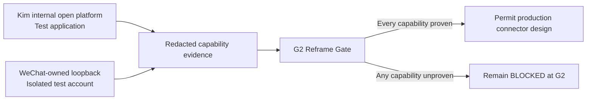

# Source-Owned Chat Interface G2 Reframe Design

**Date:** 2026-08-18

**Status:** Approved

**Scope:** Reframe the blocked Kim and WeChat feasibility gate around
vendor-owned or application-owned structured interfaces. This design does not
authorize storage, migration, production connectors, or legacy-capture
cutover.

## 1. Decision

Use a dual-track source-owned interface investigation:

- Kim: inspect the organization-authorized Kim internal open platform with a
  least-privilege test application.
- WeChat: classify WeChat-owned loopback listeners in an isolated macOS user
  with a dedicated test account.

The investigation may use one-time enterprise SSO, application registration,
and administrator approval. Normal operation must be unattended after that
one-time setup.

The WeChat investigation may classify an undocumented application-owned
loopback interface only inside the isolated test environment. It stops as soon
as progress would require proprietary-protocol guessing, authentication bypass,
process injection, or application reverse engineering.

G2 remains `BLOCK`. The investigation can produce evidence for a new G2
decision, but it cannot enable Task 7 or any downstream production work by
itself.

## 2. Current evidence

### 2.1 Kim

The installed Kim application is the Kuaishou internal collaboration product,
not a WPS/Kingsoft product with the same name. Its public product page describes
an internal open-capability platform, but no public contract proves access to a
user's personal conversation history.

Public application metadata exposes no documented URL scheme, AppleScript
dictionary, app extension, XPC contract, or loopback HTTP service suitable for
chat-history retrieval. The Kim internal open platform is therefore the only
source-owned candidate worth a safe catalog and authorization probe.

Reference: <https://kim.kuaishou.com/>

### 2.2 WeChat

WeChat's public open-platform capabilities do not include personal chat-history
retrieval. Its documented migration and backup workflow is user-visible and is
not an unattended query or incremental synchronization interface.

The installed application owns loopback listeners, but their existence proves
neither a standard protocol nor chat access. They remain untrusted candidates
until isolated classification produces self-describing, authenticated, stable
evidence.

References:

- <https://open.weixin.qq.com/>
- <https://mac.weixin.qq.com/>

### 2.3 Excluded third-party path

An existing local Chatlog process is not a source-owned interface. Its upstream
repository states that the project removed its code after a WeChat compliance
notice and no longer provides support or security fixes. The observed launch
model also places sensitive parameters in process arguments.

Chatlog is excluded from this design. Stopping, removing, or securing the
existing process is a separate user-authorized security task.

Reference: <https://github.com/sjzar/chatlog>

## 3. Trust model

Candidate interfaces are classified in this order:

1. **Preferred:** vendor-documented or organization-authorized APIs with a
   stable version, explicit scopes, and revocation.
2. **Conditionally acceptable:** an application-owned, self-describing local
   interface with explicit authentication and a stable structured schema.
3. **Rejected:** guessed proprietary protocols, authentication bypass, process
   injection, private binary reverse engineering, network interception, OCR,
   accessibility automation, clipboard automation, or third-party database
   decryption.

Credentials must be least-privilege, revocable, and short-lived where the
source supports expiry. They may be stored only in macOS Keychain. They must not
appear in command arguments, environment variables, repository files, logs,
probe reports, or DSH session events.

## 4. Architecture

This is an evidence-only layer. It does not write to the future personal-context
database and does not mount production connectors into the DSH runtime.

## 5. Kim investigation flow

1. A human signs in to the Kim internal open-platform catalog normally.
2. The catalog is inspected without invoking chat APIs or copying internal
   documentation into the repository.
3. If a relevant API exists, request a least-privilege test application through
   the normal organization approval process.
4. Use a dedicated test identity and synthetic conversations only.
5. Verify conversation paging, message history, authoritative self identity,
   stable identifiers, timestamps or ordering, edits and retractions, and an
   incremental cursor or event stream.
6. Record only redacted capability outcomes, generic field mappings, API version
   class, authorization class, and fixed failure codes.

A bot-only, notification-only, or post-install event API does not prove access
to the user's personal historical conversations.

## 6. WeChat loopback investigation flow

1. Use a dedicated macOS user and dedicated WeChat test account.
2. Confirm that each listener belongs to a correctly signed WeChat process and
   binds only to loopback.
3. Observe listener ownership and lifecycle across application restarts without
   sending traffic.
4. Apply a bounded standard-protocol classifier:
   - connect without a payload and wait briefly for a server-first banner;
   - send a standard TLS ClientHello;
   - send HTTP `OPTIONS *` without a business path, identity, or message
     parameter.
5. Continue only if the service identifies a standard protocol, explicit
   authentication challenge, or service description. A silent, proprietary,
   ambiguous, or version-unstable response ends the probe.
6. Any later capability request uses only synthetic test-account data and the
   minimum source-granted scope.

The classifier must use strict connection, byte, time, and concurrency budgets.
It must never enumerate or query the current user's live chat history.

## 7. Required capability evidence

Both sources must independently prove all of the following from authoritative
source fields:

1. active self-account identity;
2. conversation and participant identity;
3. stable message identity;
4. final message text;
5. authoritative sender or direction;
6. a stable timestamp or ordering key;
7. incremental change detection.

Edits, retractions, deletes, reply links, paging, authorization scopes, and
version stability are recorded as explicit capabilities. Model inference cannot
replace missing source evidence.

## 8. Evidence boundary

Committed reports may contain only:

- `PASS`, `NOT PROVEN`, or `BLOCK` outcomes;
- generic field-mapping categories;
- protocol or API version class;
- authorization class;
- fixed failure codes.

Reports must not contain tokens, cookies, internal URLs, raw responses,
organization identifiers, account identifiers, messages, participant names,
paths, keys, counts, or correlatable hashes. Internal Kim operation names are
not committed if they are not public information.

Synthetic fixtures prove parser and failure behavior only. They do not prove
the live product schema or business capability.

## 9. Failure behavior

Every probe fails closed. Unknown protocol, version drift, missing fields,
unstable identifiers, excessive scopes, authentication failure, or inconsistent
responses produce `NOT PROVEN` or `BLOCK`.

The probes do not retry authentication automatically. Cancellation terminates
all child processes and removes temporary state. Diagnostic output is limited
to fixed failure codes, and no probe becomes a background service.

If either source fails, both production chat connectors remain disabled and the
legacy capture path remains unchanged.

## 10. Testing and review

Testing has three layers:

1. synthetic contract tests for protocol classification, authentication
   challenges, paging, cursors, edit and retraction events, and malformed data;
2. isolated integration tests with dedicated identities and synthetic messages;
3. independent specification and security review of the redacted live evidence.

G2 passes only when both sources prove every required capability with stable,
authoritative evidence and an acceptable authorization model. Passing the
classifier alone is not a G2 pass.

## 11. GUI boundary

No chat-history GUI is built during this feasibility work. The probes produce
redacted reports only.

After G2 passes, the DSH GUI may add a source-authorization page showing
connection state, granted scope category, synchronization health, last success,
and a revoke action. It never displays credentials or raw diagnostic responses.

## 12. Stop and unblock conditions

The investigation stops immediately if it needs protocol guessing,
authentication bypass, private reverse engineering, process injection, UI
automation, or real-user chat data.

Task 7 remains prohibited until:

1. both isolated probes complete inside the approved trust boundary;
2. both sources prove every required capability;
3. independent review marks the revised G2 decision `PASS`.
